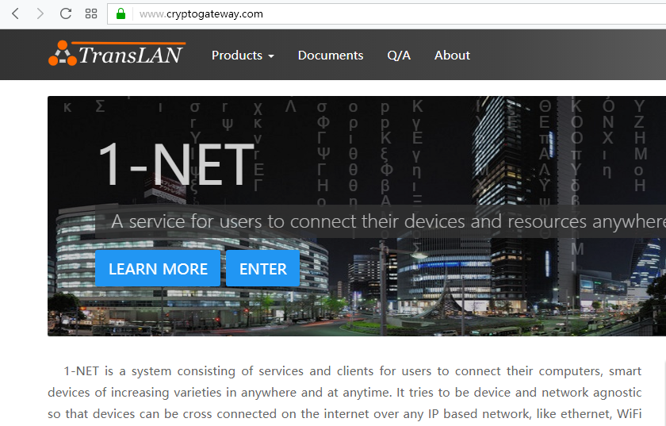

Derived from [electron-browser](https://github.com/pfrazee/electron-browser).

# V-NET-browser

A browser for 1-NET, based on electron, written in react.



**Install instructions**

To run this code, follow these steps:

```
git clone https://github.com/webarchymeta/v-net-browser
cd v-net-browser
npm install
webpack
npm run bootstrap
```

The last command will start a tray icon on user's desktop. When clicked, a list of active V-NET gateway ports available to the current LAN will be listed.

```
npm start
```

Starts the browser in normal mode, without going through a the V-NET gateway tunnel.

```
npm run register
```

Registers the browser with a running 1-NET desktop client, which can be used to launch the browser for a specific V-NET gateway tunnel (port) from within.

## License

MIT
